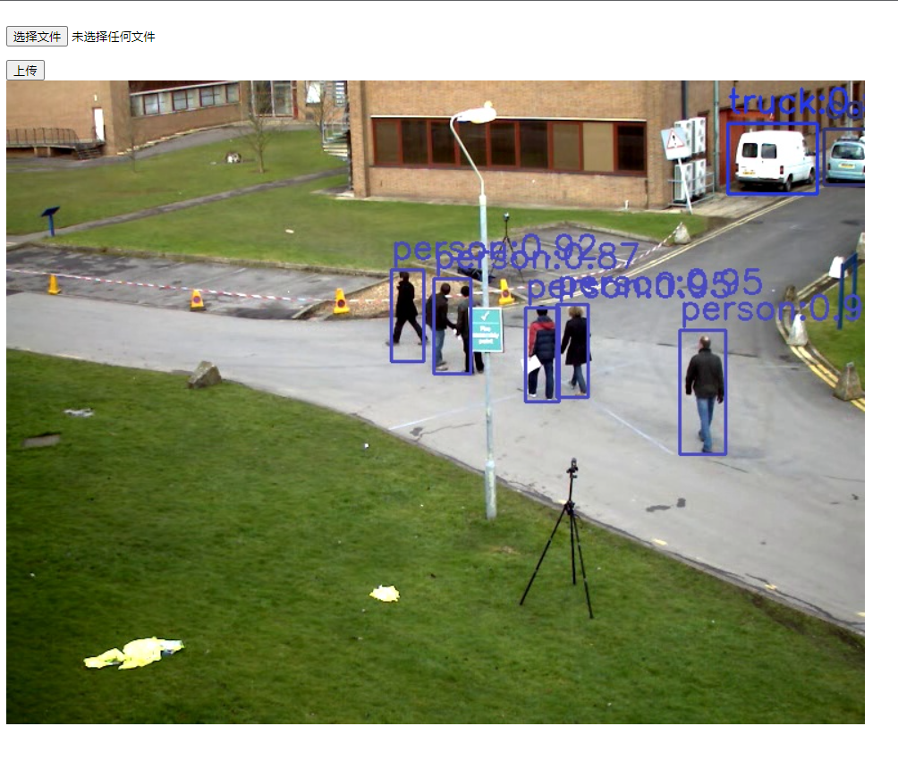

# flask_video_object_detection

<br/>

# Requirements
- windows
- python >= 3.6.0
- opencv-python >= 4.2.X
- flask >= 1.0.0

## Demo

- Inference with v3-fastest

  ```python main.py --model v3_fastest --det True```

- Inference with v4-tiny

  ```python main.py --model v4_tiny --det True```

- Inference with v5-dnn

  ```python main.py --model v5_dnn --det True```

- Inference with NanoDet

  ```python main.py --model vx_ort --det True```


## Reference

- [https://blog.csdn.net/weixin_43868376/article/details/96872615](https://blog.csdn.net/weixin_43868376/article/details/96872615)
- [https://github.com/ppogg/YOLO-Streaming](https://github.com/ppogg/YOLO-Streaming)
- [https://github.com/WZMIAOMIAO/deep-learning-for-image-processing/tree/master/deploying_service/deploying_pytorch/pytorch_flask_service](https://github.com/WZMIAOMIAO/deep-learning-for-image-processing/tree/master/deploying_service/deploying_pytorch/pytorch_flask_service)
